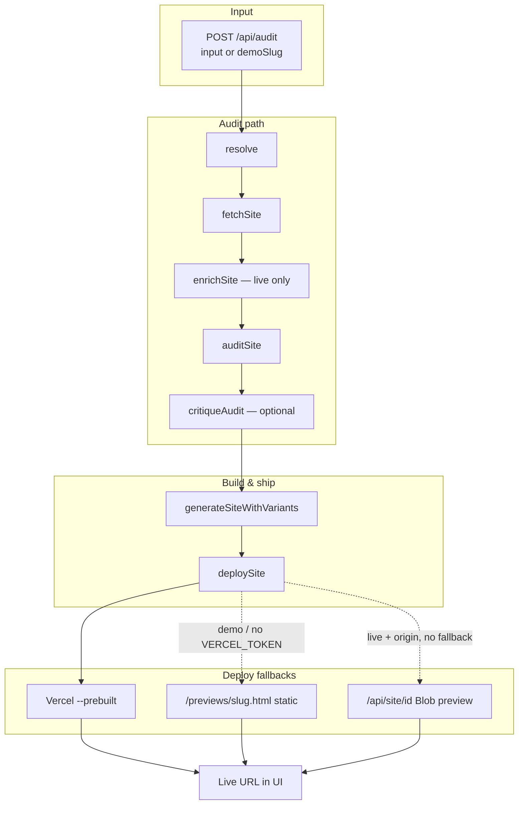

# Stylus

**Autonomous site agent for Miami small businesses.**

Paste a business name or URL. Stylus resolves the target, snapshots the live site (or replays a cached fixture), audits it with a structured model, fills a Miami-neon single-page template, and returns a deployable link — all in one streamed flow, typically under 90 seconds on stage Wi‑Fi.

Built with [Cursor Composer](https://cursor.com) and the cursor-agent CLI.

---

## How it works (end-to-end)

### User flow

1. Open the app at `/` and either click a **demo business** or type a **name / URL** and run the pipeline.
2. The UI consumes **Server-Sent Events** from `POST /api/audit` and updates in real time: step trace, reasoning tokens, agent graph (when variant mode is on), score cards, SEO gap panel, Lighthouse deltas, before/after shots, deploy link, QR share card, and cost receipt.
3. When the stream emits `{ type: "done" }`, the **Open live site** link points at the new page (Vercel deploy, static demo preview, or Blob-backed preview — see deploy below).

### Pipeline (server)

The audit route runs one async pipeline and encodes each milestone as SSE `data: {JSON}\n\n`.



| Phase | Module | What happens |
|--------|--------|----------------|
| **Resolve** | `lib/agent/resolve.ts` | URL → normalized `https` URL + inferred name; plain name → demo match URL if known, else name-only (`resolved: false`). |
| **Fetch** | `lib/agent/fetchSite.ts` | `demoSlug` or `DEMO_MODE` name match → cached snapshot. Else Firecrawl → Cheerio → **degraded snapshot** (never throws). |
| **Enrich** | `lib/agent/enrichSite.ts` | Live path only: lightweight web snippets for brand tier (`iconic` / `established` / `generic`). Fails open to `generic`. Demo replay skips this step. |
| **Audit** | `lib/agent/auditSite.ts` | Demo slug → cached audit. Else **DeepSeek V4 on DeepInfra** (streaming JSON) with Zod validation + one repair retry; missing key or failure → `buildFallbackAudit()`. |
| **Critique** | `lib/agent/critiqueAudit.ts` | Optional (`CRITIC_MODE=true`): second DeepInfra pass scores how grounded the audit is; emits `critique` SSE. |
| **Generate** | `lib/agent/generateSite.ts` | Default: deterministic template fill from audit (`lib/template/singlePage.ts`). `LIVE_GENERATION` + `VARIANT_MODE`: multi-provider copy race, agent council SSE, winner selection. |
| **Deploy** | `lib/agent/deploySite.ts` | Vercel CLI `--prebuilt` when `VERCEL_TOKEN` is set. On failure, fallbacks in order (see below). |

After deploy, the route may emit **screenshots** (Thum.io URLs), **Lighthouse** / **seo_validation** (`LIGHTHOUSE_MODE=true`), then `{ type: "done" }`.

### Deploy resolution (no dead links on demo)

1. **Vercel** — real deploy when `VERCEL_TOKEN` is present.
2. **Demo static preview** — each fixture has `deployFallbackUrl: "/previews/<slug>.html"`. Files are generated at build time by `prebuild` → `scripts/prebuild-previews.ts` (template render per cached audit → `public/previews/`). Next serves them with **no Blob token and no serverless state**. Relative paths are resolved to `origin + path` in the audit route before SSE.
3. **Blob preview** — if `BLOB_READ_WRITE_TOKEN` is set and `origin` is available, HTML is stored via `@vercel/blob` and served at `GET /api/site/[id]`. Used for live runs without Vercel or demo fallback.
4. Otherwise the stream ends with `{ type: "error" }`.

**Offline demos:** run with demo buttons only (or `DEMO_MODE=true`); fetch/audit use cache; deploy uses `/previews/<slug>.html`. No API keys required.

### Data contracts

All agent outputs are validated with **Zod** (`lib/schema.ts`):

- `SiteSnapshot` — fetch result (headings, contact, `rawText`, `degraded` flag).
- `SiteAudit` — six dimension scores (0–100) with reasons, `topFixes`, `brand` block, optional `brandTier`.
- `DeployResult` — `{ url, provider, ms }`.
- `StreamEvent` — discriminated union for every SSE payload (steps, audit, deploy, agent events, lighthouse, critique, etc.).

Generated sites are a single self-contained HTML file: inline Miami-neon CSS, tap-to-call, JSON-LD, OG tags, brand-tier styling (`iconic` strips the grid background; `generic` keeps it).

---

## Architecture (UI + APIs)

```
Browser (app/page.tsx)
  │  POST /api/audit  (SSE)
  ▼
app/api/audit/route.ts  ── orchestrator
  ├── lib/agent/*       ── resolve, fetch, enrich, audit, generate, deploy
  ├── lib/demo/seed     ── five JSON fixtures + DEMO_MODE
  ├── lib/previewStore  ── optional Blob preview
  └── lib/lighthouse    ── PageSpeed / seeded scores

Static assets
  public/previews/*.html  ── prebuilt demo deploy targets

Other routes
  POST /api/deploy      ── deploy from existing SiteAudit JSON
  POST /api/seo-gap     ── competitor gap (Tavily or seed)
  GET|POST /api/mcp     ── MCP tools: redevelop_smb_site, audit_smb_site
  GET /api/site/[id]    ── Blob preview HTML
```

**UI panels (driven by SSE, no extra round-trips for core path):**

| Panel | SSE / source |
|--------|----------------|
| Audit stream | `step`, `reasoning`, `variant_progress` |
| Agent graph | `agent_*`, `agent_verdict` (variant council) |
| Score card + critique pill | `audit`, `critique` |
| SEO gap | `audit` → client `POST /api/seo-gap` |
| Lighthouse + structured-data badge | `lighthouse`, `seo_validation` |
| Before/after + visual slider | `shots`, deploy URL |
| Deploy share (QR + copy) | `deploy` |
| Provider scoreboard | `provider_result` |
| Cost receipt | client-side from provider events + wall time |

---

## Quick start

### Prerequisites

- Node.js 20+
- [Vercel CLI](https://vercel.com/docs/cli) on `PATH` (only for real Vercel deploys)
- API keys optional for **demo-only** use

### Install & run

```bash
git clone git@github.com:patrickbdevaney/stylus.git
cd stylus
npm install
cp .env.example .env.local
npm run dev
```

Open [http://localhost:3000](http://localhost:3000). Use a **demo button** for a fully keyless path, or enter a live name/URL when keys are configured.

`npm run build` runs **prebuild** first and writes `public/previews/<slug>.html` for all five demos.

---

## Environment variables

Copy `.env.example` → `.env.local`.

| Variable | Required for | Purpose |
|----------|----------------|---------|
| `DEEPINFRA_API_KEY` | Live audit (+ critic) | DeepSeek V4 audit via OpenAI-compatible API |
| `AUDIT_MODEL` | No | Default `deepseek-ai/DeepSeek-V4-Flash` |
| `FIRECRAWL_API_KEY` | Live fetch | Primary scrape; Cheerio fallback if unset |
| `VERCEL_TOKEN` | Real deploy | `vercel deploy --prebuilt` |
| `BLOB_READ_WRITE_TOKEN` | Live Blob preview | Fallback when Vercel fails and no demo `deployFallbackUrl` |
| `DEMO_MODE` | No | `true` → name-matched businesses use cached snapshot/audit |
| `LIVE_GENERATION` | No | `true` → live LLM copy instead of template-only fill |
| `VARIANT_MODE` | No | `true` + live generation → multi-provider variant race + agent SSE |
| `TAVILY_API_KEY` | No | Live SEO gap research; seed data if unset |
| `LIGHTHOUSE_MODE` | No | `true` → PageSpeed before/after + `seo_validation` on deploy URL |
| `CRITIC_MODE` | No | `true` → skeptical audit reviewer after audit event |

**Demo stage (zero keys):** click any demo slug → cached resolve/fetch/audit → generate from template → deploy URL `/previews/<slug>.html` (served statically).

---

## Demo fixtures

Five businesses in `lib/demo/cache/`:

| Slug | Business |
|------|----------|
| `versailles` | Versailles Restaurant |
| `joes-stone-crab` | Joe's Stone Crab |
| `panther-coffee` | Panther Coffee |
| `gramps-bar` | Gramps |
| `robert-is-here` | Robert Is Here |

Each JSON file holds `snapshot`, `audit`, optional `reasoningTrace`, and `deployFallbackUrl` → `/previews/<slug>.html`. Snapshot/audit bodies are not modified at runtime.

`demoSlug` in `POST /api/audit` replays the cached trace (no enrich step). `input` matching a demo name uses the same cache when `DEMO_MODE=true` or when fetch/audit hit the demo matchers.

---

## Scripts & testing

```bash
npm run dev            # Next.js dev server
npm run build          # prebuild previews + production build
npm run start          # Production server
npm run lint           # ESLint
npm run deploy:shell   # CLI: generate shell HTML + Vercel deploy

npm test               # Offline tsx harness (DEMO_MODE, keys stripped)
npm run test:unit      # Vitest: pure lib/*.vtest.ts (node, no React)
```

The **tsx harness** (`scripts/test/`) exercises Zod contracts, pipeline modules against fixtures, and in-process `POST /api/audit` — intended for CI and venue Wi‑Fi verification.

**Vitest** covers template escaping, SEO gap seeds, fallback audit, parse helpers, and lighthouse helpers without a browser.

---

## Stack

- **Framework** — Next.js 14 App Router, React 18, TypeScript, Tailwind
- **Validation** — Zod
- **Fetch** — Firecrawl + Cheerio + degraded fallback
- **Audit** — DeepInfra OpenAI-compatible API (DeepSeek V4 Flash), deterministic fallback
- **Generate** — Template fill; optional multi-provider copy race (Groq, Cerebras, DeepInfra, etc. when `VARIANT_MODE`)
- **Deploy** — Vercel prebuilt; static `public/previews/` for demos; optional Vercel Blob preview
- **Streaming** — SSE from `POST /api/audit`

---

## API reference

### `POST /api/audit`

Full pipeline; response is `text/event-stream`.

```json
{ "input": "Versailles Restaurant" }
```

```json
{ "demoSlug": "versailles" }
```

**Main event types:** `step`, `reasoning`, `resolve`, `snapshot`, `audit`, `critique`, `deploy`, `shots`, `lighthouse`, `seo_validation`, `variant_progress`, `provider_result`, `variant_winner`, `agent_spawn` | `agent_active` | `agent_done` | `agent_handoff` | `agent_verdict`, `done`, `error`.

### `POST /api/deploy`

Deploy from an existing audit (no SSE):

```json
{ "audit": { /* SiteAudit */ } }
```

### `POST /api/seo-gap`

Competitive SEO gap + JSON-LD suggestion:

```json
{ "businessName": "Versailles Restaurant", "category": "Cuban restaurant" }
```

### `GET` / `POST /api/mcp`

JSON-RPC MCP surface. `GET` returns tool manifest; `tools/call` supports:

- `audit_smb_site` — resolve → fetch → audit only (fast, no deploy)
- `redevelop_smb_site` — full audit + generate + deploy/preview

---

## Visual spec

Stylus UI and generated pages share **Miami Vice / South Beach at night**:

- **Base** — `#0a0a12`
- **Neon** — pink `#ff2d95`, cyan `#00f0ff`, purple `#9d4edd`, orange `#ff6b35`
- **Type** — Bebas Neue display + system UI body
- **Generated pages** — one `index.html`, inline CSS, sticky tap-to-call, JSON-LD

---

## Roadmap

- [ ] Real URL discovery from arbitrary business names (beyond demo cache)
- [ ] Richer generation (imagery, multi-page) beyond template fill
- [ ] Screenshot-aware audits in the audit model
- [ ] Cloudflare Pages deploy path (schema already allows `cloudflare`)
- [ ] Owner dashboard — re-run audits, track deployed sites

---

## License

Private — hackathon / demo project.
