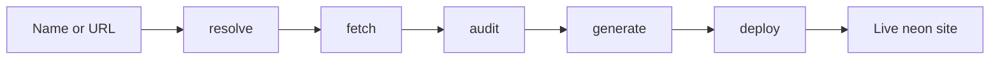

# Stylus

**Autonomous site agent for Miami small businesses.**

Paste a business name or URL. Stylus resolves the target, snapshots the live site, runs a structured Claude audit with visible reasoning, fills a Miami-neon single-page template, and deploys a replacement — all in one streamed flow under 90 seconds.

Built with [Cursor Composer](https://cursor.com) and the cursor-agent CLI.

---

## What it does

| Step | What happens |
|------|----------------|
| **Resolve** | URL passthrough or name → best-guess URL |
| **Fetch** | Firecrawl scrape, Cheerio fallback, or degraded snapshot (never hard-fails) |
| **Audit** | Claude tool output → Zod-validated scores + plain-language reasons |
| **Generate** | Template-fill from audit: hero, services, about, contact, tap-to-call |
| **Deploy** | Vercel `--prebuilt` → public URL on screen |

The UI streams every step over SSE: animated pipeline trace, score cards, and a before/after preview panel — tuned for live demos and projectors.



---

## Quick start

### Prerequisites

- Node.js 20+
- [Vercel CLI](https://vercel.com/docs/cli) on your `PATH` (for deploy)
- API keys (optional for offline demo — see below)

### Install & run

```bash
git clone git@github.com:patrickbdevaney/stylus.git
cd stylus
npm install
cp .env.example .env.local
npm run dev
```

Open [http://localhost:3000](http://localhost:3000), pick a **demo business**, or enter a name/URL and click **Run Stylus**.

### Environment variables

Create `.env.local` from `.env.example`:

| Variable | Required | Purpose |
|----------|----------|---------|
| `ANTHROPIC_API_KEY` | Live audit | Claude structured audit |
| `FIRECRAWL_API_KEY` | Live fetch | Primary site scrape |
| `VERCEL_TOKEN` | Live deploy | Programmatic Vercel deploy |
| `DEMO_MODE` | No | `true` → cached fetch/audit for matching demo names |

Without keys, use the **demo picker** — five pre-cached Miami businesses run fully offline for fetch and audit. Deploy falls back to an on-host preview URL when Vercel is unavailable.

---

## Demo mode

Five cached fixtures ship in `lib/demo/cache/`:

- Versailles Restaurant
- Joe's Stone Crab
- Panther Coffee
- Gramps
- Robert Is Here

Each includes a `SiteSnapshot`, `SiteAudit`, and replayable reasoning trace — no network required for the fetch + audit path. Ideal for venue Wi-Fi and projector demos.

Set `DEMO_MODE=true` to route typed names that match a demo business through the cache as well.

---

## Scripts

```bash
npm run dev          # Next.js dev server
npm run build        # Production build
npm run start        # Production server
npm run lint         # ESLint
npm run deploy:shell # CLI smoke test: deploy empty shell to Vercel
```

---

## Stack

- **Framework** — Next.js 14 (App Router), React 18, TypeScript, Tailwind
- **Validation** — Zod (`SiteAuditSchema`, `SiteSnapshotSchema`)
- **Fetch** — Firecrawl API + Cheerio fallback
- **Audit** — Anthropic SDK (Claude Sonnet, tool use)
- **Deploy** — Vercel CLI `--prebuilt --public`
- **Streaming** — Server-Sent Events from `POST /api/audit`

---

## Project layout

```
app/
  page.tsx              # Landing + demo picker + full pipeline UI
  api/audit/route.ts    # SSE: resolve → fetch → audit → generate → deploy
  api/deploy/route.ts   # Standalone deploy endpoint
  api/site/[id]/        # On-host preview fallback
components/
  AuditStream.tsx       # Animated step trace
  ScoreCard.tsx         # Dimension scores + top fixes
  BeforeAfter.tsx       # Original vs deployed preview
lib/
  agent/                # resolve, fetchSite, auditSite, generateSite, deploySite
  template/singlePage.ts
  demo/cache/           # Pre-cached Miami businesses
  schema.ts             # Zod contracts
scripts/
  deploy-shell.ts       # Deploy smoke test
```

---

## API

### `POST /api/audit`

Runs the full pipeline and streams JSON events:

```json
{ "input": "Versailles Restaurant" }
// or
{ "demoSlug": "versailles" }
```

Event types: `step`, `reasoning`, `resolve`, `snapshot`, `audit`, `deploy`, `done`, `error`.

### `POST /api/deploy`

Deploy from an existing audit:

```json
{ "audit": { /* SiteAudit */ } }
```

---

## Visual spec

Stylus and generated sites share a **Miami Vice / South Beach at night** aesthetic:

- **Base** — `#0a0a12` deep night
- **Neon** — pink `#ff2d95`, cyan `#00f0ff`, purple `#9d4edd`, orange `#ff6b35`
- **Type** — Bebas Neue display + Inter body
- **Generated pages** — self-contained `index.html`, inline CSS, mobile-first tap-to-call

---

## Roadmap

- [ ] Real URL discovery from business names (not just demo cache)
- [ ] Richer generation beyond template fill (imagery, multi-page)
- [ ] Screenshot-aware audits
- [ ] Cloudflare Pages deploy path (schema already supports it)
- [ ] Owner dashboard — re-run audits, track deployed sites

---

## License

Private — hackathon / demo project.
